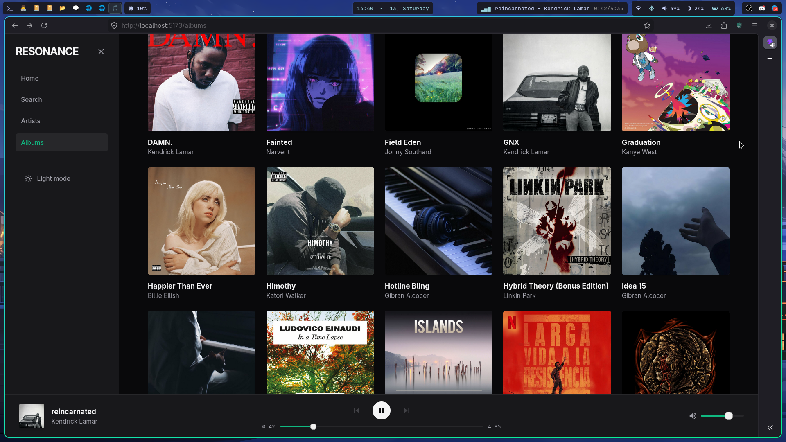

# Resonance

A local-first music player built exclusively for FLAC libraries.




Context: I built Resonance because I wanted a lightweight player for my local FLAC collection and used it as an opportunity to learn database design, media streaming, and frontend state management.

Resonance is a music player for people who keep their own FLAC libraries. It scans a local music directory, builds a SQLite index, and streams tracks through a React interface.

---

## Features

- Browse albums and artists from a local FLAC library
- Search tracks, albums, and artists
- Rediscovery queue for resurfacing random tracks from the local library
- Stream music without importing files into the browser
- OS MediaSession integration (hardware media keys, Waybar support)
- Light and dark themes

## Implementation Highlights

- Normalized SQLite schema with junction tables
- HTTP byte-range streaming
- Tokenized search engine
- Zustand-based playback state

---

## Tech Stack

| Layer | Technology |
|---|---|
| Backend | Node.js, Express , SQLite |
| Metadata parsing | music-metadata |
| Frontend | React , Vite |
| State management | Zustand |
| Routing | React Router |
| Styling | Tailwind CSS |

---

## How It Works

```
FLAC files on disk
      │
      ▼
sync-database.js      ← DFS scanner + music-metadata parser
      │
      ▼
SQLite (resonance.db) ← normalized index: artists, albums, tracks, track_artists
      │
      ▼
Express API           ← byte-range streaming, artwork extraction, search
      │
      ▼
React + Zustand       ← UI, playback state, MediaSession binding
      │
      ▼
<audio> element       ← native browser decode
```

The filesystem is the source of truth. The database stores only metadata and a `file_path` string pointing to each FLAC on disk. Audio is never copied or re-encoded.

For full technical detail such as schema design, search pipeline, streaming implementation, Zustand architecture, and engineering tradeoffs see [docs/ARCHITECTURE.md](./docs/ARCHITECTURE.md).

---

## Key Engineering Challenges Solved

- Many-to-many artist relationships using a junction table
- HTTP byte-range streaming for large FLAC files
- Tokenized search across tracks and albums
- Persistent audio state outside the React render tree

---

## Installation

**Prerequisites:** Node.js v18+, a local directory of `.flac` files.

```bash
# 1. Clone
git clone https://github.com/Vishwajit1610/Resonance.git
cd Resonance

# 2. Install backend dependencies
cd backend && npm install

# 3. Configure environment — create backend/.env
MUSIC_DIRECTORY=/absolute/path/to/your/flac/folder
PORT=3000

# 4. Index your library (run once; re-run after adding files)
node sync-database.js

# 5. Start the backend
npm run dev

# 6. Open a new terminal — install and start frontend
cd ../frontend && npm install && npm run dev
```

Open **http://localhost:5173**

> FLAC-only by design. Lossy formats (MP3, AAC) have inconsistent embedded metadata. Supporting them would require fallback heuristics that compromise ingestion reliability.

---

## Project Structure

```
Resonance/
├── backend/
│   ├── server.js          # Express API + streaming engine
│   ├── database.js        # SQLite schema initialization
│   ├── scanner.js         # DFS filesystem walker
│   └── sync-database.js   # Ingestion: scan → parse → insert
│
└── frontend/src/
    ├── components/layout/ # Sidebar, PlayerBar, MainViewport, App
    ├── components/ui/     # AlbumCard, TrackCard, ScrollRow
    ├── views/             # Home, Albums, AlbumTracks, Artists, Search
    ├── store/             # Zustand player store
    ├── hooks/             # useTheme, useDebounce
    └── index.css          # Design token system
```

---

## Disclaimer

Resonance is a local-first music player that indexes and plays audio files stored on the user's device.

This repository contains only the application source code and does not include, host, distribute, or provide access to any copyrighted media.

Users are responsible for ensuring they have the necessary rights to any audio files used with the application.

## License

MIT

                                  |
                                 |||
                                |||||
                  |    |    |   |||||||
                 )_)  )_)  )_)   ~|~
                )___))___))___)\  |
               )____)____)_____)\\|
             _____|____|____|_____\\\__
             \                       /
       ~^~^~~^~^~~^~^~~^~^~~^~^~~^~^~~^~^~~^~^~
               ~^~  all aboard!  ~^~
       ~^~^~~^~^~~^~^~~^~^~~^~^~~^~^~~^~^~~^~^~
